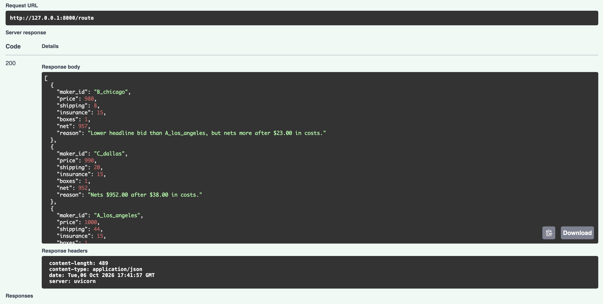

# Net-Proceeds Bid Router

Ranks partner bids by what a seller actually **nets** after shipping, insurance, and delay, not by headline price.

Built as a one-hour prototype for [Tradepost](https://tradepost.co)'s marketplace problem: when several market makers bid on an item, the highest bid isn't always the best outcome.

## The idea

A seller in Chicago has a $1,000 item and three bids:

| Market maker | Headline bid | Shipping | Insurance | Delay | **Net** |
|---|---|---|---|---|---|
| A (Los Angeles) | $1,000 | $44 | $15 | $9 | **$932** |
| C (Dallas) | $990 | $20 | $15 | $3 | **$952** |
| B (Chicago) | $980 | $8 | $15 | $0 | **$957** |

The highest bid ranks last. The router returns every bid with its cost breakdown and a one-line reason for its rank.



## Run it

```bash
pip install -r requirements.txt
uvicorn main:app --reload     # then open http://127.0.0.1:8000/docs
pytest -v                     # 17 tests
```

`POST /route` takes an item, the seller's zip, and a list of bids. The example in `/docs` is pre-filled with the scenario above.

## How it works

`net = bid price − shipping − insurance − delay penalty`

- **Shipping:** flat rate per box, plus a charge per distance zone
- **Insurance:** 1.5% of declared value
- **Multi-box rule:** items above $2,500 split into multiple boxes, so shipping scales with box count
- **Delay penalty:** $3 per transit day beyond 2
- **Tie-breaks:** net, then faster transit, then maker id, so results are deterministic

Bids with negative net proceeds are still returned, but flagged and ranked last, so the caller can see why they were rejected instead of having bids silently disappear.

## Assumptions

All rates and market makers are **mock data**. This is a thinking tool, not a model of Tradepost's real system. The numbers live in `data.py`.

## What I'd do next

- Replace the rate table with real carrier quotes
- Score market makers on dispute rate and time-to-confirm
- Backtest against historical orders to measure the dollar lift over "pick the top bid"

See [ideas for next steps](docs/tradepost-next-ideas.md) for more.